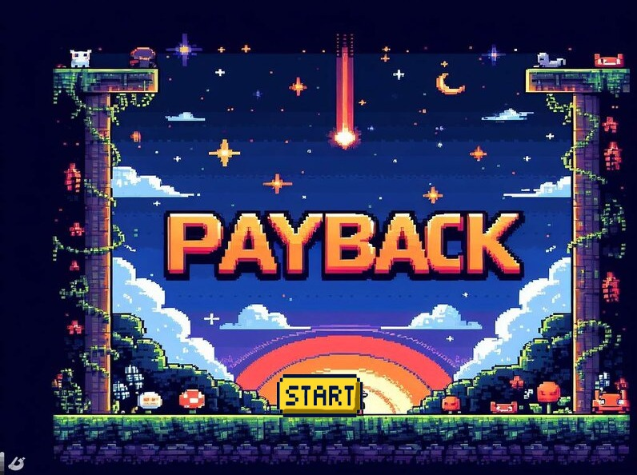
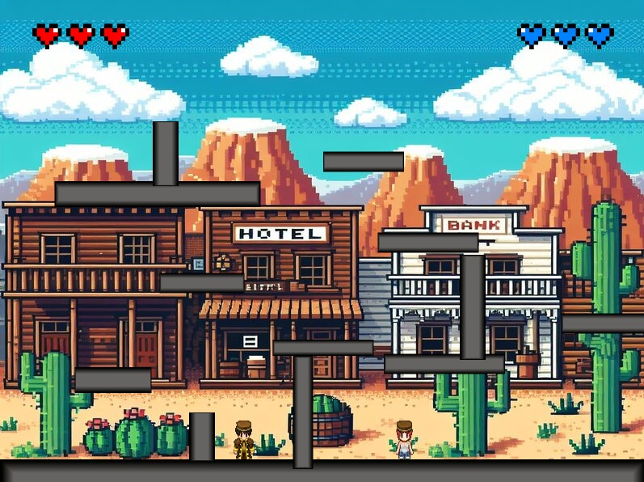
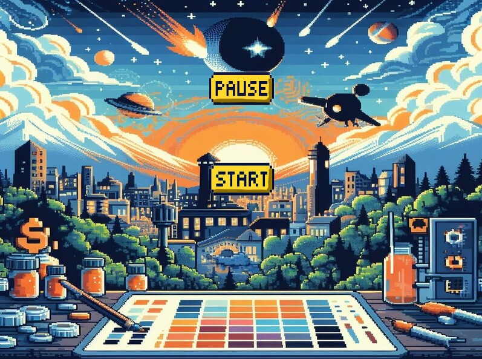
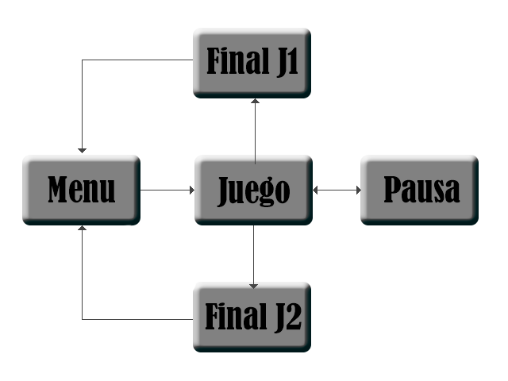

# PAYBACK

Game Design Document

Versión: 0.2.1

Grupo 5

Escrito por:
María González Martínez-Cubells: m.gonzalezma.2020@alumnos.urjc.es / https://github.com/mgmcubells
José Antonio Moratalla Zabala: ja.moratalla.2020@alumnos.urjc.es / https://github.com/janmorata
Javier Luis Moreno Erustes: jl.moreno.2020@alumnos.urjc.es / https://github.com/ChonLarsen
Carlos Vega San Román: c.vegas.2020@alumnos.urjc.es

ÍNDICE

Resumen	4
Concepto del juego	4
Características del juego	4
Género	5
Juego de lucha	5
Disparos	5
Plataformas	6
Público objetivo	6
Jugabilidad	7
Referencias a otros videojuegos	7
Historia y trasfondo	8
Mecánicas de juego	9
Mecánicas	9
Movimiento	9
Armamento	9
PowerUps	9
Supervivencia	10
Sistema de combate	10
Plataformas	10
Elección de personajes	10
Personajes	11
Características de los personajes	11
Cámaras	12
Periféricos	13
Controles	13
Movimiento y físicas	14
Movimiento sobre plataformas	14
Interacción entre elementos	14
Colisiones y Física del Juego	14
Interfaz	15
Diagrama de Flujo	15
Menú Principal	16
Menú de Selección del Personaje	16
Menú de Pausa	17
Escenarios	17
Modos de juego	17
Progresión y personalización	17
Arte y sonido	17
Estilo artístico 2D	17
Colores	18
Música y efectos de sonido	18
Referencias de otros videojuegos	19
Monetización	19
Equipo	19

Resumen

Este es el  documento de diseño del juego Payback, diseñado y desarrollado por Grupo 5, conformado por los miembros: María González Martínez-Cubells, José Antonio Moratalla Zabala, Javier Luis Moreno Erustes, Carlos Vega San Román. 
Se trata de un juego de lucha y plataformas multijugador donde para ganar el jugador deberá derrotar a su rival acabando con todas sus vidas.  Es un videojuego diseñado y desarrollado para PC con gráficos 2D.

Concepto del juego
Payback es un emocionante juego de lucha en 2D que permite enfrentamientos de hasta dos jugadores simultáneamente. En este dinámico juego, los jugadores asumen el control de diversos héroes, cada uno con habilidades y características únicas, participando en intensas batallas multijugador. El objetivo principal es utilizar estrategias y habilidades de combate para eliminar a los oponentes, con la meta final de ser el último jugador en pie. Payback destaca por su amplia gama de personajes, cada uno con su propio conjunto de movimientos especiales y estilo de pelea, lo que añade profundidad y variedad a la experiencia de juego. Además, el juego ofrece una diversidad de arenas con distintos diseños y características que afectan la jugabilidad, manteniendo las batallas frescas y desafiantes. Para mantener el interés de los jugadores a largo plazo, Payback incluye varios modos de juego, desde combates rápidos y frenéticos hasta torneos estructurados, proporcionando así una experiencia rica y envolvente para todos los aficionados a los juegos de lucha.

Características del juego
Payback, el juego de lucha en 2D, se distingue por una serie de características que lo hacen atractivo y divertido para los jugadores. A continuación, se describen algunas de sus principales características:

Multijugador: Permite enfrentamientos entre dos jugadores, promoviendo la competencia y la interacción directa entre amigos.

Variedad de personajes: Ofrece una amplia gama de héroes jugables, cada uno con habilidades, movimientos y estilos de combate únicos, permitiendo a los jugadores encontrar el personaje que mejor se adapte a su estilo de juego.

Diversidad de arenas: Incluye múltiples escenarios de batalla, cada uno con su propio diseño y características específicas que pueden influir en la estrategia de los jugadores y en la dinámica de las peleas.

Gráficos en 2D: Presenta gráficos en 2D bien detallados y animaciones fluidas que capturan la esencia de los clásicos juegos de lucha, mientras aportan un toque moderno y atractivo visualmente.

Controles intuitivos: Los controles están diseñados para ser fáciles de aprender pero difíciles de dominar, permitiendo a los nuevos jugadores comenzar rápidamente, mientras que los jugadores experimentados pueden perfeccionar sus habilidades y técnicas.

Actualizaciones y contenido adicional: El juego se mantiene fresco mediante actualizaciones regulares que pueden incluir nuevos personajes, arenas y modos de juego, asegurando que siempre haya algo nuevo para los jugadores.

Estas características combinadas hacen de Payback un juego atractivo tanto para los aficionados a los juegos de lucha como para aquellos que buscan una experiencia divertida y competitiva con amigos.

Género
Payback pertenece al género de juegos de lucha en 2D, un subgénero de los juegos de acción que se caracteriza por enfrentar a dos o más personajes en combates directos. Estos juegos se centran en el control preciso del personaje, la ejecución de movimientos especiales y combinaciones, así como en la estrategia y la táctica para derrotar al oponente.

Juego de lucha
Como se describe arriba, el juego será de peleas entre los personajes del mismo. Además, el juego estará hecho en 2D, proporcionando una perspectiva clásica y estilizada que rememora los títulos icónicos del género. Los jugadores podrán elegir entre una amplia variedad de personajes, cada uno con habilidades y estilos de combate únicos, lo que añade profundidad y estrategia a cada encuentro. El objetivo principal es vencer a los oponentes en combates intensos, utilizando una combinación de movimientos básicos y ataques especiales.

Disparos
Cada jugador tiene como objetivo eliminar a su rival, quitándole las vidas. Para ello, podrá tirarle de las plataformas y también podrá dispararle. Este elemento de disparos añade una capa adicional de estrategia. Con ello se quiere conseguir una jugabilidad bastante rápida, en la que las habilidades de cada jugador para moverse y disparar sean las que supongan la victoria y derrota. Los jugadores tendrán acceso a una variedad de armas y proyectiles, cada uno con sus propias características y efectos, lo que permite diferentes estilos de juego y tácticas.

Plataformas
Cada nivel se compone de una pantalla estática con perspectiva lateral, donde unas cuantas plataformas están colocadas a diferentes alturas. Estas funcionan como suelos y paredes, y los jugadores pueden moverse por la pantalla saltando de una a otra, lo que ayuda a añadir una dimensión vertical a la jugabilidad y más complejidad. Las plataformas no solo sirven como terreno de combate, sino también como obstáculos y oportunidades estratégicas. Por ejemplo, los jugadores pueden usar las plataformas para evadir ataques, planear emboscadas desde arriba o forzar a sus oponentes a posiciones desfavorables. La variedad en el diseño de los niveles y la disposición de las plataformas aseguran que cada combate sea único y lleno de sorpresas.

Público objetivo
Payback es un juego enfocado a jugadores que buscan competitividad y frenetismo contra otros usuarios. Está diseñado para atraer a una amplia variedad de jugadores, desde aficionados a los juegos de lucha y retro hasta jóvenes jugadores y entusiastas de la competencia. Su combinación de combate en 2D, elementos de disparos y plataformas, junto con una estética visual atractiva y una jugabilidad accesible pero profunda, lo hacen adecuado para una audiencia diversa que busca tanto diversión casual como competencia intensa. 
A estos jugadores les debe gustar los juegos de acción rápida donde pongan a prueba sus habilidades. No será para todos los públicos debido a la violencia con armas, será apto para mayores de 16 años.

Las interacciones sociales y la comunidad en torno a Payback desempeñan un papel fundamental en la experiencia de juego y en la construcción de una comunidad sólida.

Foros y redes sociales: el videojuego cuenta con foros en línea y presencia en redes sociales donde los jugadores pueden interactuar entre sí, compartir consejos y estrategias, discutir las últimas actualizaciones del juego y conectarse con la comunidad en general. Estos espacios proporcionan un medio para que los jugadores se comuniquen, se relacionan y se mantengan informados sobre las novedades y eventos relacionados con el juego.

Eventos y torneos: El juego organiza regularmente eventos y torneos en los que los jugadores pueden participar para ganar recompensas exclusivas, demostrar sus habilidades en el combate y competir por el reconocimiento dentro de la comunidad. Estos eventos fomentan la participación activa de los jugadores, promueven la competitividad saludable y fortalecen el sentido de comunidad al reunir a jugadores de diferentes partes del mundo para enfrentarse en desafíos emocionantes.

Jugabilidad
La jugabilidad de Payback se distingue por su dinamismo y profundidad, ofreciendo una experiencia envolvente tanto para jugadores casuales como para aquellos más dedicados. Aquí se detallan los principales aspectos de la jugabilidad:

Combate en 2D
El juego se desarrolla en un plano bidimensional, lo que facilita la precisión en los movimientos y ataques. Los combates son rápidos e intensos. Los jugadores pueden realizar una variedad de movimientos básicos combinados con disparos.
Elementos de disparos
Los jugadores tienen acceso a armas de fuego y proyectiles que pueden usar para atacar a distancia. Estas armas añaden una capa extra de estrategia, ya que los jugadores deben manejar los ataques a larga distancia. Los disparos permiten a los jugadores mantener a raya a sus oponentes y controlar el ritmo del combate, obligando a los oponentes a moverse constantemente y planificar sus ataques cuidadosamente.
Plataformas
Diseño de niveles: Cada nivel consiste en una pantalla estática con una disposición de plataformas a diferentes alturas. Los jugadores pueden saltar y moverse entre estas plataformas, lo que añade una dimensión vertical a la jugabilidad. Las plataformas no solo actúan como terreno, sino también como elementos estratégicos que los jugadores pueden usar para evadir ataques, lanzar emboscadas o posicionarse en lugares ventajosos.

Payback tendrá diferentes niveles donde competir. Cada uno de ellos tendrá una disposición de plataformas diferentes, que ayudarán a que los jugadores no se aburran con un solo nivel, si no que puedan ir probando distintos escenarios.
El jugador controlará al personaje que escoja, y podrá desplazarse por el escenario, andando horizontalmente por las distintas plataformas, y verticalmente saltando a las diferentes alturas que se disponen en el nivel.

Referencias a otros videojuegos

Payback se inspira en Super Smash Bros en varios aspectos de su jugabilidad, como el combate frenético y rápido en Payback el combate es rápido y frenético. Los jugadores se enfrentan en arenas de batalla donde el objetivo es derrotar a los oponentes. Ambos juegos fomentan la acción rápida y recompensan la habilidad y la destreza del jugador en el combate cuerpo a cuerpo.
Ambos presentan controles simples que permiten a los jugadores realizar una variedad de movimientos y ataques. A pesar de su simplicidad, ambos videojuegos ofrecen una profundidad considerable en términos de estrategia y habilidad. Los jugadores pueden aprender combos, técnicas avanzadas y aprovechar al máximo las habilidades únicas de cada personaje para ganar ventaja sobre sus oponentes.
La selección de personajes es variada y distintiva, los jugadores pueden elegir entre una amplia gama de personajes, cada uno con su propio estilo de juego, habilidades especiales y personalidad. Estos personajes provienen de diferentes trasfondos y universos temáticos, lo que añade variedad y diversión a las partidas.

Historia y trasfondo

La historia y el trasfondo de Payback se desarrollan en un mundo inmerso en el caos y el conflicto, donde diferentes fuerzas militares y facciones luchan por el poder y la supremacía. La trama se centra en la competencia entre varios personajes, cada uno con sus propios motivos y objetivos, que los impulsan a participar en intensos enfrentamientos uno contra uno.

El trasfondo de cada personaje se construye en torno a su origen y contexto histórico, que varía desde soldados de élite de la Segunda Guerra Mundial hasta guerreros modernos y futuristas. Cada personaje tiene una historia única que refleja su pasado, sus experiencias y sus motivaciones personales para participar en la contienda de Payback.

Las motivaciones para actuar por cada personaje del juego pueden ser diversas:

Venganza: Algunos personajes pueden buscar vengarse de un enemigo específico que los ha traicionado o causado daño en el pasado. Su participación en Payback les brinda la oportunidad de enfrentarse directamente a su adversario y saldar cuentas.

Ambición: Otros personajes pueden estar motivados por el deseo de ascender en las filas militares o ganar renombre y reconocimiento en el campo de batalla. Participar les ofrece la oportunidad de demostrar su valía y habilidades en combate.

Lealtad: Algunos personajes pueden estar comprometidos con una causa o una facción específica, y participan para defender los intereses de su grupo y cumplir con su deber como soldados.

Supervivencia: Para otros, la participación puede ser una cuestión de supervivencia, donde se ven obligados a luchar por su vida en un mundo donde la ley del más fuerte prevalece.

Redención: Algunos personajes pueden buscar redimirse de acciones pasadas o errores cometidos, y ven en una oportunidad para demostrar su valía y cambiar su destino.

Estas motivaciones personales agregan profundidad y complejidad a la trama de Payback, y proporcionan un contexto emocional y psicológico para las intensas batallas que se desarrollan en el juego. Cada personaje tiene su propia historia que los impulsa a enfrentarse en combate, lo que crea una dinámica fascinante y emocionante para los jugadores mientras exploran el mundo.

Mecánicas de juego

Payback es un juego en el que dos jugadores controlan a distintos personajes con los que deben enfrentarse hasta que uno de los dos acabe sin vidas. Estos personajes lucharán en distintos niveles creados por plataformas colocadas en diferentes posiciones y alturas. Cada combate está diseñado para ser una mezcla intensa de estrategia, habilidad y rapidez.

Mecánicas
Las mecánicas del juego son las siguientes:

Movimiento
Los personajes podrán moverse en todas direcciones en un plano 2D, lo que permite desplazamientos horizontales y verticales fluidos. Los jugadores pueden correr, saltar y esquivar, aprovechando el entorno para evitar ataques y posicionarse estratégicamente. El sistema de movimiento es intuitivo pero ofrece profundidad, permitiendo a los jugadores dominar técnicas avanzadas como los saltos dobles y las esquivas aéreas.

Armamento
Habrá una variedad de armas de fuego pertenecientes a cada personaje. Cada arma tiene características únicas, como la cadencia de tiro, el daño, el alcance y la velocidad de recarga. Los jugadores deben aprender a manejar eficazmente sus armas y considerar cuándo disparar y cuándo conservar munición. Algunas armas pueden ofrecer habilidades especiales, como proyectiles explosivos o disparos que atraviesan obstáculos.

PowerUps
Los power-ups de recuperación de vida juegan un papel crucial en la estrategia de supervivencia durante el combate. Estos power-ups, representados por iconos en forma de corazón, permiten a los jugadores recuperar un corazón de vida al ser recogidos. Aleatoriamente ubicados en los escenarios, estos ítems de curación brindan la oportunidad de reponerse durante intensos enfrentamientos. Los jugadores deben aprender a gestionar eficazmente su salud, evaluando cuándo arriesgarse para conseguir un power-up y cuándo priorizar otras tácticas de combate. La competencia por estos valiosos recursos puede cambiar el rumbo de una batalla, añadiendo una capa adicional de profundidad y emoción al juego.

Supervivencia
El objetivo del jugador será acabar con su rival, para ello deberá reducir la vida del enemigo a cero. Los corazones de vida de cada personaje se gastan cuando recibe daño de ataques directos o proyectiles. La gestión de la vida y la capacidad de evitar daños son cruciales para la supervivencia. Además, algunos niveles pueden incluir ítems de recuperación que restauran la vida, añadiendo una capa estratégica a la gestión de recursos durante el combate.

Sistema de combate
El sistema de combate se basará en las armas, que dañan a los rivales a distancia, para ello los proyectiles deberán impactar. Los jugadores deben apuntar con precisión y anticipar los movimientos de su oponente para maximizar la efectividad de sus disparos.

Plataformas
Las plataformas serán importantes, ya que se contará con plataformas flotantes a diferentes alturas, para dificultar el fuego directo y forzar a los jugadores a moverse por todo el mapa. Las plataformas proporcionan cobertura y oportunidades tácticas, como emboscadas desde posiciones elevadas o maniobras evasivas. La disposición de las plataformas varía en cada nivel, manteniendo el combate fresco y desafiando a los jugadores a adaptarse a nuevos entornos.

Elección de personajes
Se podrá elegir a diferentes personajes preestablecidos con armas únicas para cada personaje. Cada personaje tiene su propio conjunto de habilidades y estilo de combate, lo que permite a los jugadores seleccionar el personaje que mejor se adapte a su estilo de juego. Algunos personajes pueden ser más rápidos y ágiles, mientras que otros pueden ser más resistentes y tener armas de mayor potencia. Esta variedad fomenta la experimentación y el desarrollo de estrategias personalizadas.

La combinación de combate rápido, plataformas estratégicas y una amplia variedad de personajes y armas, asegura que cada partida de Payback sea emocionante y única. Los jugadores deben utilizar su agilidad, precisión y tácticas inteligentes para dominar el campo de batalla y vencer a su oponente. La jugabilidad accesible pero profunda garantiza que tanto los nuevos jugadores como los veteranos del género encuentren algo que disfrutar.

Personajes
El juego contará con una amplia variedad de personajes, cada uno equipado con armas de fuego únicas y habilidades especiales. Cada personaje tendrá unos corazones de vida que indica su resistencia en combate, y su estética será bélica, representando figuras militares como soldados, cadetes, sargentos y otros rangos. Los personajes podrán provenir de diferentes épocas y lugares del mundo, lo que añade diversidad y riqueza histórica al juego.

Características de los personajes
Armas únicas:
Cada personaje estará armado con un conjunto exclusivo de armas de fuego, que varían en términos de cadencia de tiro, daño, alcance y velocidad de recarga. Las armas pueden incluir rifles de asalto, pistolas, escopetas, francotiradores y lanzagranadas, entre otros. Además, algunas armas podrán tener habilidades especiales, como proyectiles explosivos, munición perforante o disparos que se dividen en múltiples direcciones.

Diseño y estética:
Los personajes estarán diseñados con una estética bélica, representando diversas fuerzas militares de diferentes épocas y regiones del mundo. Esto incluye soldados de la Segunda Guerra Mundial, guerreros modernos, soldados futuristas y figuras militares históricas de diferentes culturas. La variedad en el diseño visual de los personajes no solo añade atractivo visual sino también permite a los jugadores identificarse con diferentes estilos de combate y épocas históricas.

Origen y contexto:
Cada personaje tendrá una historia y un trasfondo que refleje su origen y contexto histórico. Por ejemplo, un personaje podría ser un soldado de élite de la Segunda Guerra Mundial, mientras que otro podría ser un cadete de una unidad futurista de operaciones especiales. Estos trasfondos pueden influir en las habilidades y el armamento de los personajes, añadiendo profundidad a la jugabilidad y al desarrollo de la narrativa.

Diversidad global:
Los personajes provienen de diferentes lugares del mundo, representando a diversas fuerzas militares y culturas. Esto incluye soldados de diferentes países y continentes, cada uno con sus propias tácticas y estilos de combate. La inclusión de personajes de diversas procedencias promueve una experiencia de juego multicultural y variada.

Cámaras
La cámara estática en Payback es un elemento crucial que define la experiencia visual y la jugabilidad del juego. Esta elección de diseño se alinea con el enfoque del juego en combates en 2D y la interacción con plataformas.

La cámara estática proporciona una visión completa y constante de todo el campo de batalla, permitiendo a los jugadores ver todas las plataformas, obstáculos y a sus oponentes en todo momento. Esta perspectiva facilita la planificación estratégica y la toma de decisiones rápidas, ya que los jugadores siempre tienen una vista clara del entorno y pueden anticipar los movimientos del oponente.
La cámara también mantiene la acción centralizada, sin movimientos bruscos ni cambios de ángulo que puedan distraer a los jugadores. Por ello esto asegura que los jugadores puedan concentrarse completamente en el combate y en la navegación por las plataformas, mejorando la inmersión y la intensidad de los duelos.
Garantiza que todos los jugadores tengan la misma perspectiva del campo de batalla, proporcionando una experiencia de juego justa y equilibrada. Esto es especialmente importante en un juego competitivo, donde cualquier ventaja visual podría influir en el resultado del combate. La consistencia visual asegura que la habilidad y la estrategia sean los factores decisivos.
Se facilita el seguimiento de los personajes y proyectiles en pantalla, ya que no hay movimientos de cámara que puedan causar confusión o pérdida de la perspectiva. Los jugadores pueden seguir fácilmente la trayectoria de los disparos y los movimientos de los personajes, lo que es crucial para la precisión en el combate y la navegación estratégica.

Una cámara estática reduce la carga de procesamiento en comparación con cámaras dinámicas que requieren constantes ajustes y renderizado de diferentes ángulos. Esto puede mejorar el rendimiento del juego, proporcionando una experiencia más fluida y sin interrupciones, especialmente en dispositivos menos potentes.

En resumen, la cámara estática en Payback juega un papel fundamental en la creación de una experiencia de juego clara, justa y centrada en la acción. Al proporcionar una visión constante y completa del campo de batalla, permite a los jugadores enfocarse en el combate y la estrategia sin distracciones. Esta elección de diseño mejora la estabilidad del juego, facilita el seguimiento de los personajes y proyectiles, y asegura una experiencia visual coherente y equilibrada para todos los jugadores.

Periféricos
Para jugar a Payback, el periférico esencial es el teclado. El teclado es fundamental para controlar los movimientos y acciones de los personajes de manera precisa y efectiva.
El movimiento con el uso de teclas de dirección: Las teclas W, A, D se utilizan para mover al personaje en las cuatro direcciones:
En el caso del jugador 1:
W: Saltar.
A: Moverse a la izquierda.
D: Moverse a la derecha.
En el caso del jugador 2:
Las teclas de flecha (↑, ←, →) .
También para realizar acciones de combate
Disparo principal: La tecla f se asigna para el ataque principal del jugador 1 y la tecla p para el jugador 2, que dispara el arma principal del personaje.

El teclado permite una entrada rápida y precisa, esencial para ejecutar movimientos complejos y ataques en tiempo real. Con múltiples teclas disponibles, los jugadores pueden acceder a una variedad de comandos sin necesidad de cambiar de periférico.
La capacidad de reasignar teclas permite a los jugadores crear una configuración que se adapte mejor a su estilo de juego, aumentando la comodidad y la eficacia durante el combate.

Controles
En Payback, los controles del juego están diseñados para ser intuitivos y accesibles, proporcionando a los jugadores un manejo preciso y rápido durante el combate. La disposición de las teclas está optimizada para permitir una fluida ejecución de movimientos y acciones. 

Movimiento Jugador 1:
W, A, D:
W: Saltar.
A: Moverse a la izquierda.
D: Moverse a la derecha.

Movimiento Jugador 2:
Las teclas de flecha (↑, ←, →) servirán al jugador 2 para poder moverse por el mapa.

Acciones de combate
El disparo principal hace uso de la tecla f para el jugador 1 y la tecla p para el jugador 2: La elección de estos botones como botones de disparo permite un acceso rápido y cómodo durante el combate, asegurando que los jugadores puedan disparar sin retrasos.

La configuración de controles de Payback está diseñada para maximizar la rapidez y la comodidad del jugador. Esta disposición permite un control preciso de los movimientos y acciones, facilitando una jugabilidad fluida y estratégica. 

Movimiento y físicas
En Payback, el movimiento y las físicas son aspectos fundamentales que contribuyen a la jugabilidad dinámica y desafiante del juego. 

Movimiento sobre plataformas
El juego se desarrolla en entornos que presentan una variedad de plataformas dispuestas en diferentes alturas. Los personajes pueden desplazarse lateralmente en el eje x y verticalmente en el eje y. Los controles permiten a los jugadores moverse con fluidez y precisión, saltando entre plataformas y evitando caídas en los huecos entre ellas. La física del juego simula el peso y la inercia de los personajes, lo que agrega un elemento de realismo y desafío a la navegación por los niveles.

Interacción entre elementos
Ataques a distancia:
Los personajes pueden atacar a distancia utilizando disparos, los cuales deben ser esquivados por el rival para evitar perder corazones de vida. La precisión y la velocidad de los disparos son clave para infligir daño al oponente mientras se evaden los ataques enemigos.

Utilización del entorno:
Los jugadores pueden aprovechar las distintas plataformas y muros como cobertura para esquivar disparos enemigos y planificar estrategias ofensivas. La disposición del entorno proporciona oportunidades tácticas para emboscar al rival o ganar ventaja en el combate.

Colisiones y Física del Juego
Las colisiones que pueden ocurrir en Payback se dividen en varios tipos:

Personaje - Personaje: Cuando dos personajes entran en contacto.
Personaje - Escenario: Las colisiones entre personajes y el entorno, como las plataformas y los muros, determinan la movilidad y la estrategia de los jugadores.
Disparo - Personaje: Los disparos lanzados por un personaje pueden colisionar con otro, infligiendo daño si impacta.
Disparo - Escenario: Los disparos pueden interactuar con elementos del entorno, como muros y obstáculos, afectando su trayectoria y permitiendo tácticas de defensa y ataque.

El movimiento y las físicas en Payback ofrecen una experiencia de juego inmersiva y desafiante, donde los jugadores deben dominar la navegación por plataformas y utilizar estratégicamente los ataques a distancia y cuerpo a cuerpo para alcanzar la victoria. Las interacciones entre elementos y las colisiones añaden profundidad táctica y realismo al combate, proporcionando una experiencia emocionante y dinámica para los jugadores.

Interfaz

En Payback, cada pantalla juega un papel crucial en la experiencia de juego, proporcionando información, opciones y desafíos para los jugadores. Aquí se detallan las distintas pantallas del juego, sus transiciones y su utilidad:

Diagrama de Flujo
Este diagrama de flujo enseña las distintas pantallas que tiene el juego y sus transiciones entre ellas. El diagrama proporciona una guía visual clara de las pantallas del juego y las transiciones entre ellas, ayudando a los jugadores a navegar por el juego de manera efectiva y disfrutar de una experiencia de juego fluida y envolvente.

Menú Principal
El menú principal de Payback es la puerta de entrada a la experiencia de juego, ofreciendo una interfaz sencilla pero efectiva para que los jugadores puedan comenzar a jugar rápidamente. Este consta de varios elementos: 
Título del videojuego (Payback) ubicado en la parte superior de la pantalla, el título "Payback" se presenta de manera prominente, destacando la identidad del juego y estableciendo el tono para la experiencia que está por venir.
Dos botones de navegación: jugar y salir del juego. 
El botón "Jugar" permite a los jugadores acceder al menú de selección de personajes, donde podrán prepararse para la partida.
El botón "Salir del Juego" permite a los jugadores abandonar el juego y volver al escritorio u otro destino fuera del juego.

Menú de Selección del Personaje
El menú de selección del personaje es un espacio interactivo donde los jugadores pueden personalizar su experiencia de juego eligiendo a su personaje. Cada jugador puede elegir a su personaje favorito de entre una variedad de opciones disponibles,  pueden tener habilidades y características únicas que influyen en el estilo de juego.

Una vez que ambos jugadores han seleccionado sus personajes, pueden confirmar su preparación presionando el botón "Listo" ubicado en la parte inferior de la pantalla, cuando ambos jugadores están listos, se activa el inicio de la partida.

Menú de Pausa
El menú de pausa proporciona a los jugadores la capacidad de tomar un respiro durante la partida y realizar acciones adicionales sin interferir con la acción del juego
Acceso con la tecla "Esc" los jugadores pueden pausar la partida presionando la tecla "Esc" en su teclado. Dentro del menú de pausa, los jugadores tienen la opción de continuar la partida, salir del juego

Escenarios
Los escenarios en Payback ofrecen una variedad de entornos únicos donde se desarrolla la acción del juego.  Los jugadores pueden interactuar con el entorno para obtener ventajas tácticas, como refugiarse detrás de obstáculos o utilizar elementos del entorno para emboscar a sus oponentes.
Los escenarios cuentan con diferentes niveles en el eje y  están compuestos por plataformas flotantes, agregando una dimensión vertical a la jugabilidad y permitiendo estrategias de movimiento y combate complejas. Al inicio de la partida, cada jugador aparece en puntos distintos del mapa, lo que fomenta la estrategia al comenzar el juego.

Modos de juego
El juego principal de Payback es el modo multijugador, que permite a dos jugadores enfrentarse entre sí en línea o en local. Los jugadores pueden disfrutar del juego en un emocionante enfrentamiento uno contra uno, ya sea en línea, enfrentándose a otros jugadores de todo el mundo, o en local, jugando con amigos en la misma consola o PC.

Progresión y personalización
El juego ofrece un sistema de progresión y personalización que permite a los jugadores desbloquear nuevos personajes, trajes y accesorios a medida que avanzan en el juego.
Completar desafíos y alcanzar logros en el juego otorga a los jugadores recompensas especiales, como monedas o puntos de experiencia, que pueden usarse para desbloquear contenido adicional.

Arte y sonido

En Payback, el arte y el sonido se fusionan para crear un ambiente vívido y evocador que sumerge a los jugadores en un mundo de conflicto y desafío.

Estilo artístico 2D
El estilo artístico 2D con uso de pixel art de Payback es esencial para su identidad visual, ofreciendo una estética única que refuerza la narrativa del juego:

Los sprites, tanto de personajes como de objetos, están meticulosamente diseñados para ofrecer detalles visuales nítidos y vibrantes.
Los fondos planos proporcionan un telón de fondo estilizado que resalta la acción en primer plano, permitiendo que los elementos clave del juego destacan.
Junto a una estética belicista pero colorida, el juego adopta una estética belicista que se refleja en cada aspecto del diseño artístico. Los tonos cálidos crean una atmósfera de diversión y frenetismo que envuelve a los jugadores en un mundo inmersivo de conflicto.
Elementos visuales como cajas de munición, vehículos militares y escombros dispersos por el escenario refuerzan la sensación de estar inmerso en un campo de batalla.

Colores
El uso de colores alegres y cálidos desempeña un papel importante en la creación de una atmósfera vibrante y llena de energía que complementa la naturaleza dinámica y divertida del juego. La atracción visual de los colores alegres y cálidos, como el rojo, el amarillo, el naranja y el rosa, se utilizan en los escenarios, personajes y elementos del juego para llamar la atención del jugador de manera inmediata. Estos tonos vibrantes son visualmente estimulantes y ayudan a captar la atención del jugador en medio de la acción rápida y frenética del juego.
Lo cual transmite energía y emoción a través de los colores brillantes y cálidos transmiten una sensación de energía y emoción, lo que contribuye a la atmósfera dinámica y emocionante. Estos colores evocan sentimientos positivos y optimistas, lo que refuerza la sensación de diversión y disfrute durante el juego. 
Reflejan el tono general del juego, que es enérgico, divertido y optimista. Estos tonos positivos ayudan a establecer una experiencia de juego lúdica y entretenida que invita a los jugadores a sumergirse en el mundo del juego y disfrutar de la experiencia.

Música y efectos de sonido

La música y los efectos de sonido en Payback están cuidadosamente diseñados para elevar la experiencia de juego y aumentar la inmersión del jugador. El juego está acompañado de música rápida e intrépida que impulsa la energía del jugador y lo motiva a sumergirse en la acción. Melodías enérgicas y ritmos animados ayudan a mantener el ritmo y el flujo del juego incluso entre las partidas.
Los efectos de sonido, como disparos, explosiones y gritos de combate, añaden capas de realismo y emoción a la experiencia de juego. Cada efecto está diseñado para ser impactante y envolvente, sumergiendo a los jugadores en el caos y la adrenalina del campo de batalla.

En conjunto, el arte y el sonido en Payback trabajan en armonía para crear una experiencia de juego emocionante y envolvente. 

Referencias de otros videojuegos

El pixel art es un estilo de arte digital que utiliza píxeles individuales para crear imágenes detalladas. Muchos juegos independientes y retro utilizan pixel art debido a su estética nostálgica y capacidad para representar escenas detalladas con recursos limitados. Juegos como "Stardew Valley" es ejemplo de juego que emplea pixel art de manera efectiva y podría influenciar los gráficos 2D de Payback.

Monetización

En Payback, la monetización se basa en una estrategia que equilibra la oferta de una única compra.
En su lanzamiento, Payback se ofrece como una compra única, lo que significa que los jugadores adquieren el juego completo por un precio fijo. Esta opción permite a los jugadores acceder a todos los contenidos principales del juego, incluyendo personajes, arenas y modos de juego disponibles en el lanzamiento, sin necesidad de realizar compras adicionales.
La compra única garantiza a los jugadores que obtendrán una experiencia completa y satisfactoria desde el principio, sin restricciones ni barreras para disfrutar del juego en su totalidad.

La estrategia de monetización busca encontrar un equilibrio entre el precio inicial del juego y el valor percibido por los jugadores, asegurando que la compra única ofrezca una experiencia de juego completa y satisfactoria.

Equipo

El éxito de un juego como Payback no solo depende de su concepto y mecánicas, sino también del talento y la experiencia del equipo de desarrollo que trabaja detrás de escena.
Jefa de Arte: María González Martínez-Cubells
María lidera el equipo de arte, supervisando la creación de los elementos visuales del juego, como personajes, escenarios y efectos especiales. Trabaja en estrecha colaboración con otros miembros del equipo para garantizar que el arte del juego cumpla con los estándares de calidad y se alinee con la visión creativa del proyecto.

Jefe de programación: José Antonio Moratalla Zabala
José lidera el equipo de programación, encargado de desarrollar y mantener el código del juego, incluyendo la implementación de mecánicas de juego, la optimización del rendimiento y la corrección de errores. Coordina el trabajo del equipo para asegurarse de que el juego cumpla con los estándares de calidad y los plazos de entrega.

Jefe de proyecto: Javier Luis Moreno Erustes
Javi lidera el equipo de proyecto, supervisando la planificación, coordinación y ejecución de todas las actividades relacionadas con el desarrollo del juego. Se encarga de gestionar los recursos, presupuestos y plazos para asegurar que el proyecto se complete con éxito y dentro del tiempo y el presupuesto establecidos.

Jefe de modelado: Carlos Vega San Román
Carlos lidera el equipo de modelado, encargado de crear los modelos bidimensionales de los personajes, escenarios y objetos del juego. Supervisa el proceso de modelado, desde la creación de los bocetos iniciales hasta la implementación final en el juego.

# RESUMEN

### ESCENAS
##### Se muestra el titulo del juego junto a un botón "jugar" con el que los jugadores comienzan la partida.

###
##### En pantalla se encuentran en escenario conformado por una serie de plataformas de color gris, en estas los jugadores pueden subirse para alcanzar una ventaja táctica sobre el enemigo así como cubrirse de los disparos rivales. A su vez, en la parte superior, se encuentran las vidas de cada jugador identificadas por un color, el jugador de la izquierda tendrá los corazones rojos y el de la izquierda los azules, siendo estas de un máximo de 3. Finalmente podemos identificar los personajes en juego como Holley “Killer” Miller y Bella Gang.

###
##### Se muestra una imagen totalmente diferente a la del juego, donde se muestra en el centro de la pantalla un botón "jugar" con el que se reanuda la partida.

###
##### Se muestra una imagen en la parte superior indicando que el jugador 1 ha sido el vencedor. Abajo de esta indicación hay un boton de reinicio que permite volver al menú principal para jugar otra partida.

###
##### Se muestra una imagen en la parte superior indicando que el jugador 2 ha sido el vencedor. Abajo de esta indicación hay un boton de reinicio que permite volver al menú principal para jugar otra partida.

### DIAGRAMA DE ESCENAS

##### En este menú se muestra el desplazamiento que puede hacer el jugador entre las escenas. En primer lugar, desde el menú principal solo puede acceder al juego, desde el juego al menú de pausa, y al de victoria de cada jugador. Desde estos se puede acceder al menu principal otra vez.
### DISEÑO
##### Para el diseño del juego se ha usado la inteligencia artificial para la creación de fondos, un fondo donde podemos observar que es el antiguo oeste mezclado con toques futurísicos. Los botones y letreros se han hecho en dorado para que destaquen. 
### CONTROLES
#### JUGADOR 1
##### Salto- W
##### Izquierda - A
##### Derecha - D
##### disparo - F
#### JUGADOR 2
##### Salto- Flecha arriba
##### Izquierda - Flecha izq.
##### Derecha - Flecha dcha.
##### disparo - P
