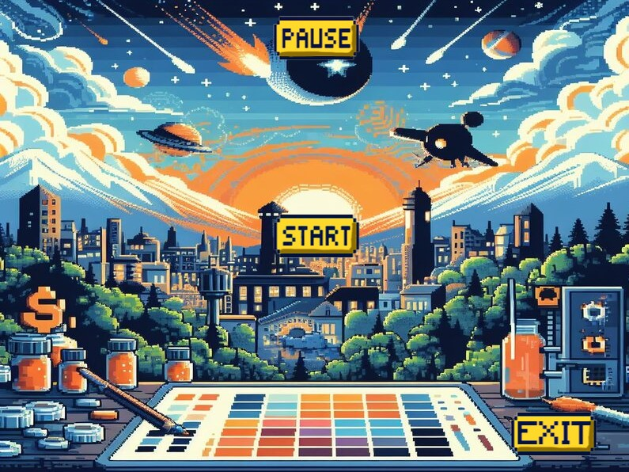

# PAYBACK

### Descripción de la temática del juego
###### PayBack es un juego de plataformas y combates 1 vs 1 en 2D de hasta 2 jugadores. Los jugadores controlan a héroes en batallas multijugador donde el objetivo es eliminar a los oponentes y ser el último en pie. El juego ofrece una amplia variedad de personajes, arenas y modos de juego para mantener a los jugadores entretenidos
###### -Carlos Vega San Román
###### -Javier Luis Moreno Erustes
###### -José Antonio Moratalla Zabala
###### -María González Martínez-Cubells

### ESCENAS
##### Se muestra el titulo del juego junto a un botón "jugar" con el que los jugadores comienzan la partida.

###
##### En pantalla se encuentran en escenario conformado por una serie de plataformas de color gris, en estas los jugadores pueden subirse para alcanzar una ventaja táctica sobre el enemigo así como cubrirse de los disparos rivales. A su vez, en la parte superior, se encuentran las vidas de cada jugador identificadas por un color, el jugador de la izquierda tendrá los corazones rojos y el de la izquierda los azules, siendo estas de un máximo de 3. Finalmente podemos identificar los personajes en juego como Holley “Killer” Miller y Bella Gang.

###
##### Se muestra una imagen totalmente diferente a la del juego, donde se muestra en el centro de la pantalla un botón "jugar" con el que se reanuda la partida.

###
##### Se muestra una imagen en la parte superior indicando que el jugador 1 ha sido el vencedor. Abajo de esta indicación hay un boton de reinicio que permite volver al menú principal para jugar otra partida.

###
##### Se muestra una imagen en la parte superior indicando que el jugador 2 ha sido el vencedor. Abajo de esta indicación hay un boton de reinicio que permite volver al menú principal para jugar otra partida.

### DIAGRAMA DE ESCENAS

##### En este menú se muestra el desplazamiento que puede hacer el jugador entre las escenas. En primer lugar, desde el menú principal solo puede acceder al juego, desde el juego al menú de pausa, y al de victoria de cada jugador. Desde estos se puede acceder al menu principal otra vez.
### DISEÑO
##### Para el diseño del juego se ha usado la inteligencia artificial para la creación de fondos, un fondo donde podemos observar que es el antiguo oeste mezclado con toques futurísicos. Los botones y letreros se han hecho en dorado para que destaquen. 
### CONTROLES
#### JUGADOR 1
##### Salto- W
##### Izquierda - A
##### Derecha - D
##### disparo - F
#### JUGADOR 2
##### Salto- Flecha arriba
##### Izquierda - Flecha izq.
##### Derecha - Flecha dcha.
##### disparo - P
